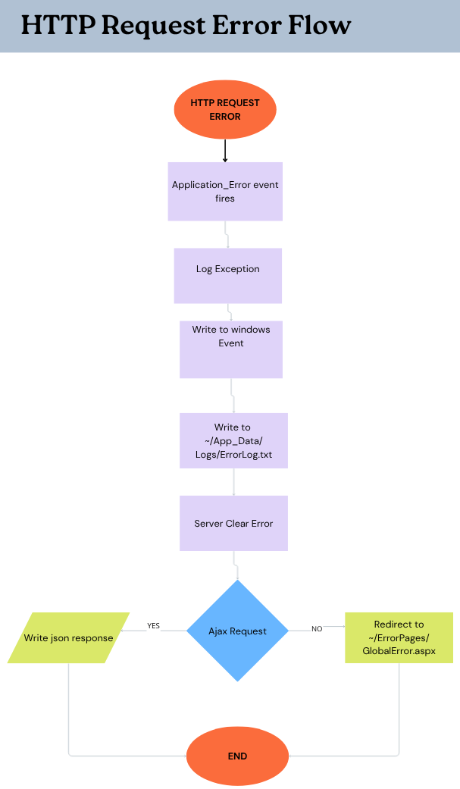
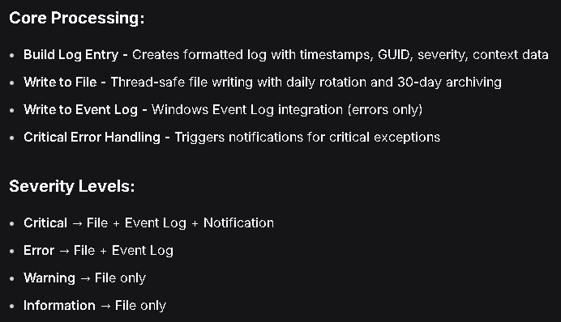
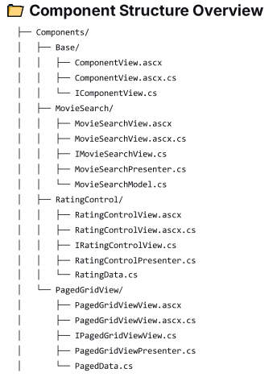

# Dotnet WebForms Application with MVP Pattern
> code examples using dotnet and C#

## The Context
The main issue with standard Web Forms is that the Ul logic, in code-behind files, is often tightly mixed with business logic, making it very difficult to write unit tests.

 ## The Solution: MVP Pattern 
For a .NET WebForms application, MVP is an excellent and well-suited architectural choice. Its primary value lies in making an existing, complex WebForms application testable and maintainable. The MVP pattern will enable the following features effectively:
- **Testability**:
- - The core logic lives in the Presenter, which is a plain C# class that doesn't depend on the ASP.NET runtime. This allows you to write unit tests for it without spinning up a web server
- **Separation of Concerns**:
- - MVP forces a clear separation. The View (the .aspx page) is just a "dumb" interface (IUserView e.g.). It only sets or displays data and raises events, while the Presenter does the heavy lifting, like calling the database and deciding what to show next.

 ## MVP Passive View 
- This is one of few ways to implement the MVP pattern.
- In the Passive View mode the View has zero logic, making it the most testable. 

 ## The Project Structure
 - We are going to be building a Movie Manager application using the MVP pattern.
 - Whithin this project we are making use of validators and a gridView.
   
 |  | |
|---------|------------|
|||

# Global Error Handling
- The purpose is to have request errors handled as following:

  
## Necessary settings
### **Global.asax** Application-Level Error Handling

 ```csharp 
    void Application_BeginRequest(object sender, EventArgs e)
    {
         string requestId = Guid.NewGuid().ToString();
         Context.Items["RequestId"] = requestId;  //Store requestId in HttpContext.Items
         Context.Response.AddHeader("X-Request-ID", requestId);
    }
    /// <summary>
    /// 
    /// </summary>
    void Application_EndRequest(object sender, EventArgs e)
    {
        if(Context.Response.StatusCode >= 400)
        {
            LogHttpError(Context);
        }
    }

    /// <summary>
    /// 
    /// </summary>
    protected void Application_Error(object sender, EventArgs e)
    {
        //Get the exception that caused the error
        Exception ex = Server.GetLastError();
    
        //Get the http context
        HttpContext context = HttpContext.Current;
    
        //Log the exception
        LogException(ex, context);
    
        //clear the errir to orevent default yellow screen
        Server.ClearError();
    
        //check if it is an AJAX request
        if (IsAjaxRequest(Context))
        {
            HandleAjaxError(ex, context);
        }
        else
        {
            //redirect to custom error page
            RedirectToErrorPage(ex, context);
        }
    }
    /// <summary>
    /// 
    /// </summary>
    private void RedirectToErrorPage(Exception ex, HttpContext context)
    {
        context.Session["LastError"] = ex;
        context.Session["LastErrorUrl"] = context.Request.Url.ToString();
    
        context.Response.Redirect("~/ErrorPages/GlobalError.aspx");
    }
    
    //Other methods
    void Application_End(object sender, EventArgs e)
    private void LogHttpError(HttpContext context)
    private void LogException(Exception ex, HttpContext context)
    private void WriteToLogFile(string message)
    private void WriteToEventLog(string message)
```
### **Web.config**
- You should care about these element names:
   ```xml
    <customErrors>, <providers>, <trace>, <compilation>, <system.webServer>, <appSettings>   
   ````

### **MVP Presenter** Error Handling
- Create a ErrorLog class to log errors, warnings and informations about the request. Follow this core processing:


### **HTTP Module** for Centralized Logging
- This module subscribe itself to the Global.asax.cs's Context.Error event
 ```csharp
public class GlobalErrorHandlerModule : IHttpModule
{
    public void Init(HttpApplication context)
    {
        _logger = new ErrorLogger();
        context.Error += OnError;
        context.BeginRequest += Context_BeginRequest;
        context.EndRequest += Context_EndRequest;
    
    }
    private void Context_EndRequest(object sender, EventArgs e)...
    private void Context_BeginRequest(object sender, EventArgs e)...
    private void OnError(object sender, EventArgs e)...
}
````
### **Health Monitoring** Setup
- So far we've built a comprehensive manual logging system using custom modules and Global.asax event handlers.
- To enable Health Monitoring, we need to add a <healthMonitoring> section to the Web.config file
- However the manual logging we've built logs more custom information and give us more complete control, this way we wil not implement Health Monitoring via Web.config file.

## Custom Reusable Components
- We're building custom reusable components that integrate seamlessly with the MVP architecture while maintaining separation of concerns and testability.
### Components Structure


