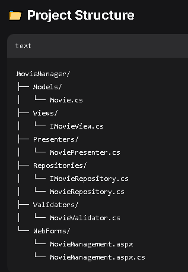
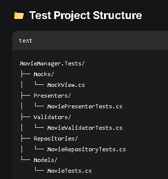

# Dotnet WebForms Application with MVP Pattern
> code examples using dotnet and C#

## The Context
The main issue with standard Web Forms is that the Ul logic, in code-behind files, is often tightly mixed with business logic, making it very difficult to write unit tests.

 ## The Solution: MVP Pattern 
For a .NET WebForms application, MVP is an excellent and well-suited architectural choice. Its primary value lies in making an existing, complex WebForms application testable and maintainable. The MVP pattern will enable the following features effectively:
- **Testability**: The core logic lives in the Presenter, which is a plain C# class that doesn't depend on the ASP.NET runtime. This allows you to write unit tests for it without spinning up a web server
- **Separation of Concerns**: MVP forces a clear separation. The View (the .aspx page) is just a "dumb" interface (IUserView e.g.). It only sets or displays data and raises events, while the Presenter does the heavy lifting, like calling the database and deciding what to show next.

 ## MVP Passive View 
- This is one of few ways to implement the MVP pattern.
- In the Passive View mode the View has zero logic, making it the most testable. 

 ## The Project
 - We are going to be building a Movie Manager application using the MVP pattern.
 - Whithin this project we are making use of validators and a gridView.
   
 |  | |
|---------|------------|
|||

# Global Error Handling
- For the aplication error handling we set up a global error as the following:
- - Global.asax Application-Level Error Handling

 ```csharp 
void Application_Start(object sender, EventArgs e)
{        
    Application["StartTime"] = DateTime.Now;
    AppDomain.CurrentDomain.UnhandledException += CurrentDomain_UnhandledException;
}
/// <summary>
/// 
/// </summary>
void Application_BeginRequest(object sender, EventArgs e)
{
    Context.Response.AddHeader("X-Request-ID",Guid.NewGuid().ToString());
}
/// <summary>
/// 
/// </summary>
void Application_EndRequest(object sender, EventArgs e)
{
    if(Context.Response.StatusCode >= 400)
    {
        LogHttpError(Context);
    }
}
/// <summary>
/// 
/// </summary>
private void CurrentDomain_UnhandledException(object sender, UnhandledExceptionEventArgs e)
{
    Exception ex = e.ExceptionObject as Exception;
    if (ex != null) 
    { 
        LogException(ex,HttpContext.Current);
    }
}
/// <summary>
/// 
/// </summary>
protected void Application_Error(object sender, EventArgs e)
{
    //Get the exception that caused the error
    Exception ex = Server.GetLastError();

    //Get the http context
    HttpContext context = HttpContext.Current;

    //Log the exception
    LogException(ex, context);

    //clear the errir to orevent default yellow screen
    Server.ClearError();

    //check if it is an AJAX request
    if (IsAjaxRequest(Context))
    {
        HandleAjaxError(ex, context);
    }
    else
    {
        //redirect to custom error page
        RedirectToErrorPage(ex, context);
    }
}
/// <summary>
/// 
/// </summary>
private void RedirectToErrorPage(Exception ex, HttpContext context)
{
    context.Session["LastError"] = ex;
    context.Session["LastErrorUrl"] = context.Request.Url.ToString();

    context.Response.Redirect("~/ErrorPages/GlobalError.aspx");
}

//Other methods
void Application_End(object sender, EventArgs e)
private void LogHttpError(HttpContext context)
private void LogException(Exception ex, HttpContext context)
private void WriteToLogFile(string message)
private void WriteToEventLog(string message)
```
  - Custom Error Pages Configuration
  - HTTP Module for Centralized Logging
  - MVP Presenter Error Handling
  - Unhandled Exception Logger
  - Health Monitoring Setup


